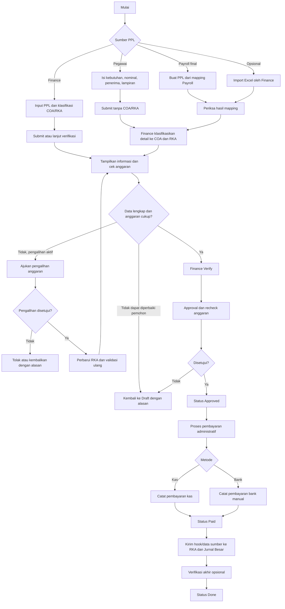

# PPL Implementation Plan

## 1. Informasi Dokumen

| Atribut | Nilai |
|---|---|
| Project | ERP SIFNEXT — MVP |
| Fitur | PPL (Permintaan Pembayaran Langsung) |
| Platform | Odoo 19 Community |
| Referensi utama | `PLAN.md` bagian 3.3.4, ERD MVP SIFNEXT, dan diagram alur PPL |
| Status | Implementasi parsial — PPL Core dan Budget Control selesai; integrasi lanjutan masih terbuka |
| Tanggal | 5 September 2026 |

Dokumen ini adalah rencana implementasi fitur PPL. `PLAN.md` tetap menjadi sumber kebutuhan/SRS utama apabila terdapat perbedaan interpretasi.

## 2. Tujuan

Membangun fitur PPL yang dapat:

- menerima pengajuan pembayaran manual dari pegawai;
- menerima pengajuan yang dibuat Tim Keuangan;
- membuat PPL langsung dari payroll final sebagai use case prioritas;
- mendukung beberapa detail/item dalam satu PPL;
- memungkinkan Finance mengklasifikasikan detail PPL ke COA dan RKA;
- memvalidasi ketersediaan anggaran setelah klasifikasi Finance;
- menjalankan verifikasi dan persetujuan;
- mencatat pembayaran melalui kas atau bank;
- menyediakan hook/data sumber setelah status `paid` untuk modul Jurnal Besar; dan
- menyediakan audit trail untuk seluruh perubahan status.

PPL berhenti pada pencatatan pembayaran administratif dan penyelesaian proses. Addon PPL tidak membuat, mem-posting, membalik, atau mengelola `account.move`; jurnal transaksi dan buku besar dimiliki modul Jurnal Besar.

## 3. Ruang Lingkup MVP

### 3.1 Termasuk dalam MVP

- Input PPL manual oleh pegawai dan Tim Keuangan.
- Pembuatan PPL dari payroll final.
- Multiple item/detail dalam satu PPL.
- Nomor PPL otomatis, unik, dan terkunci.
- Referensi unit, pemohon, vendor/penerima, RKA, COA, dan payroll.
- Pegawai mengajukan kebutuhan dan nominal tanpa memilih COA/RKA.
- Finance mengklasifikasikan setiap detail ke COA dan RKA sebelum verifikasi.
- Informasi total anggaran, realisasi, dan sisa anggaran dari modul RKA.
- Validasi anggaran saat klasifikasi Finance, Verify, Approve, dan Payment.
- Workflow `Draft → Diajukan → Diverifikasi → Disetujui → Dibayar → Selesai`.
- Pengembalian pengajuan dengan alasan.
- Pembayaran kas dan bank secara administratif.
- Hook/data sumber idempotent untuk integrasi modul Jurnal Besar setelah `paid`.
- RBAC, record rules, audit trail, activity, dan notifikasi.
- API untuk operasi utama setelah workflow internal stabil.
- Unit test dan integration test dasar.

### 3.2 Kandidat opsional MVP

Fitur berikut hanya dikerjakan setelah keputusan Product Owner dan kesiapan modul terkait:

- Import PPL dari Excel.
- Pelampauan/pengalihan anggaran dan approval-nya.
- Penggunaan `account.tax` untuk kalkulasi pajak penuh.

### 3.3 Di luar ruang lingkup MVP

- Integrasi Host-to-Host dengan bank.
- Instruksi pembayaran langsung ke sistem bank.
- Rekonsiliasi bank otomatis.
- RKA bertingkat/induk-child.
- Penguncian periode transaksi.
- Dashboard keuangan tahunan.
- Approval bertingkat yang dinamis.
- Pembuatan, posting, reversal, dan konfigurasi jurnal transaksi.
- Pengelolaan serta pelaporan buku besar.

## 4. Prinsip dan Keputusan Awal

Keputusan berikut adalah rekomendasi awal dan harus dikonfirmasi pada Implementation Gate:

- RKA MVP menggunakan struktur flat sesuai SRS.
- COA menggunakan `account.account` sebagai referensi klasifikasi.
- Scope PPL berakhir pada `paid` dan opsional `done`; status `done` menandai penyelesaian administratif.
- PPL tidak membuat atau mengelola `account.move`.
- Saat menjadi `paid`, PPL memanggil hook integrasi dengan payload/data sumber untuk modul Jurnal Besar dan RKA.
- Modul Jurnal Besar bertanggung jawab atas idempotensi jurnal, balancing, posting, reversal, dan laporan buku besar.
- Waktu reservasi/realisasi anggaran menjadi kontrak modul RKA; PPL hanya melakukan validasi dan memanggil hook integrasi.
- Pengajuan yang dikembalikan kembali ke `draft`, dengan alasan wajib dan audit trail.
- Konfirmasi pembayaran dilakukan role `PPL Finance Payment`.
- Import Excel dan pengalihan anggaran bersifat opsional.
- Pembayaran bank pada MVP hanya pencatatan administratif, tanpa Host-to-Host.
- Pegawai/User tidak memilih atau mengubah COA dan RKA.
- Finance mengisi COA dan RKA per detail; Finance pembuat PPL dapat mengisinya sejak Draft.
- PPL manual pegawai boleh di-Submit tanpa COA/RKA, tetapi tidak boleh diverifikasi sebelum klasifikasi lengkap.
- Pemilihan COA memfilter RKA berdasarkan mapping COA, unit, periode, company, dan status RKA.
- Revisi kembali ke `draft`; status terminal `rejected` masih memerlukan keputusan Product Owner.

## 5. Kontrak Model Lintas Squad

Nama teknis berikut wajib dikonfirmasi sebelum integrasi dikerjakan.

| Domain | Model teknis | Field/kontrak minimum | Owner | Status |
|---|---|---|---|---|
| Unit | TBD | kode, nama, company | Master Data | Open |
| Pegawai | TBD / evaluasi `hr.employee` | user, unit, company | HC | Open |
| RKA | TBD | unit, periode, total, realisasi, company, state, mapping COA, validasi dan hook realisasi | Finance/RKA | Open |
| Payroll Batch | TBD | periode, status final, total net, unit, company | HC | Open |
| Slip Gaji | TBD | employee, batch, net salary, komponen | HC | Open |
| COA | `account.account` | code, name, company | Odoo Accounting | Confirmed |
| Integrasi Jurnal Besar | TBD | menerima nomor/tanggal PPL, penerima, detail COA, nominal, company, metode dan referensi pembayaran, sumber payroll, serta idempotency key | Squad Jurnal Besar | Open |
| Vendor/Penerima | `res.partner` | name, company, bank data bila perlu | Odoo Base | Confirmed |

Kontrak RKA harus menyediakan operasi aman untuk membaca anggaran tersedia, memvalidasi mapping COA, serta menerima hook realisasi pembayaran bila disepakati. Kontrak Jurnal Besar menerima data PPL setelah `paid` dan bertanggung jawab atas idempotensi, jurnal balance, posting, reversal, dan buku besar. Kontrak payroll harus menyediakan penanda final dan mekanisme idempotent untuk relasi ke PPL.

## 6. Pembagian Tanggung Jawab Input

| Sumber/Pembuat | Data kebutuhan | COA | RKA | Pemeriksaan anggaran |
|---|---|---|---|---|
| Pegawai/User | Mengisi header, penerima, deskripsi, nominal, dan lampiran | Tidak dapat memilih/mengubah | Tidak dapat memilih/mengubah | Setelah diklasifikasikan Finance |
| Finance | Mengisi atau memeriksa data pengajuan | Dapat memilih per detail | Ditentukan sistem dari mapping COA; Finance memilih hanya jika kandidat lebih dari satu | Langsung saat COA dipilih, lalu saat Verify |
| Payroll | Dibentuk dari payroll final | Diisi dari mapping payroll | Ditentukan dari mapping payroll/RKA | Otomatis; hasil tetap diperiksa Finance |

Aturan tanggung jawab:

- Pegawai hanya menyampaikan kebutuhan pembayaran dan bukti pendukung; pegawai tidak menentukan klasifikasi accounting atau anggaran.
- Finance mengelompokkan setiap detail ke COA yang sesuai.
- Setelah COA dipilih, sistem mencari RKA yang valid berdasarkan mapping COA, unit, periode, company, dan status RKA.
- Jika hanya satu RKA yang cocok, sistem mengisinya otomatis; jika lebih dari satu, Finance memilih dari kandidat yang difilter; jika tidak ada, Verify diblokir.
- Finance pembuat PPL dapat melakukan klasifikasi sejak Draft.
- Finance Verifier dapat melengkapi atau mengoreksi klasifikasi pada PPL `submitted`.
- COA dan RKA dikunci setelah `verified`; koreksi berikutnya harus melalui pengembalian.
- Pembatasan akses diberlakukan pada UI, ORM, RPC, import, dan API.

## 7. Alur Bisnis



## 8. Status dan Transisi Workflow

| Label | Nilai teknis | Deskripsi |
|---|---|---|
| Draft | `draft` | Dapat diedit oleh pemohon sesuai hak akses |
| Diajukan | `submitted` | Menunggu verifikasi Finance |
| Diverifikasi | `verified` | Menunggu persetujuan Approver/Direktur |
| Disetujui | `approved` | PPL disetujui dan siap dicatat pembayarannya |
| Dibayar | `paid` | Pembayaran administratif tercatat dan hook integrasi dikirim |
| Selesai | `done` | Proses PPL selesai |

Transisi utama:

```text
Draft → Submitted → Verified → Approved → Paid → Done
```

Transisi pengembalian:

```text
Submitted → Draft
Verified  → Draft
```

Aturan workflow:

- Record baru selalu `draft`.
- Hanya PPL `draft` yang dapat diedit penuh.
- PPL non-Draft tidak dapat dihapus oleh user biasa.
- Submit oleh pegawai memvalidasi header, minimal satu detail, nominal positif, penerima/lampiran sesuai aturan, tetapi tidak mewajibkan COA/RKA.
- Submit oleh Finance dapat menyertakan COA/RKA dan menampilkan hasil pemeriksaan anggaran.
- Finance Verifier dapat mengisi/mengoreksi COA dan RKA pada status `submitted`.
- Verify hanya dapat dilakukan Finance Verifier dan wajib memvalidasi seluruh COA/RKA, mapping, company, unit, periode, pajak, lampiran, serta kecukupan anggaran.
- Approve hanya dapat dilakukan PPL Approver dan menjalankan ulang pemeriksaan anggaran.
- Payment hanya dapat dilakukan terhadap PPL `approved` setelah metode, tanggal, dan referensi pembayaran lengkap.
- Perubahan menjadi `paid` memanggil hook integrasi RKA/Jurnal Besar; PPL tidak membuat jurnal.
- Done hanya dapat dilakukan dari `paid`.
- Pengembalian wajib menyimpan alasan, user, dan timestamp.
- Semua method workflow memvalidasi state dan grup di server, bukan hanya melalui tombol UI.
- Pemanggilan action berulang harus idempotent atau ditolak dengan pesan bisnis yang jelas.

## 9. Desain Model Data

### 9.1 Header PPL

Model awal: `sifnext.ppl`.

| Field | Type | Keterangan |
|---|---|---|
| `name` | Char | Nomor PPL otomatis dan immutable |
| `request_date` | Date | Tanggal permintaan |
| `unit_id` | Many2one | Unit pemohon |
| `applicant_id` | Many2one | Pegawai pemohon |
| `vendor_id` | Many2one | Vendor/penerima; aturan wajib masih Open |
| `source_type` | Selection | `manual`, `finance`, `payroll`, opsional `excel` |
| `request_type` | Selection/Char | Jenis permintaan |
| `title` | Char | Judul PPL |
| `description` | Text | Keterangan umum |
| `line_ids` | One2many | Detail PPL |
| `amount_untaxed` | Monetary | Total sebelum pajak |
| `tax_amount` | Monetary | Total pajak |
| `total_amount` | Monetary | Nilai total computed |
| `budget_total` | Monetary | Informasi total RKA |
| `budget_realization` | Monetary | Informasi realisasi dari modul RKA |
| `budget_remaining` | Monetary | Informasi anggaran tersedia |
| `payroll_batch_id` | Many2one | Payroll sumber |
| `payment_method` | Selection | `cash` atau `bank` |
| `payment_date` | Date | Tanggal pembayaran |
| `payment_reference` | Char | Referensi kas/bank |
| `state` | Selection | Status workflow |
| `company_id` | Many2one | Company |
| `currency_id` | Many2one | Mata uang |
| `return_reason` | Text | Alasan pengembalian terakhir |

Model menggunakan `mail.thread` dan `mail.activity.mixin`. Field audit mencakup `submitted_by/at`, `verified_by/at`, `approved_by/at`, `paid_by/at`, dan `done_by/at`.

### 9.2 Detail PPL

Model awal: `sifnext.ppl.line`.

| Field | Type | Keterangan |
|---|---|---|
| `ppl_id` | Many2one | Header PPL |
| `rka_id` | Many2one | RKA detail; diisi otomatis dari mapping atau dipilih Finance dari kandidat terfilter sebelum Verify |
| `account_id` | Many2one | COA (`account.account`); dipilih Finance atau diisi mapping payroll |
| `description` | Char/Text | Deskripsi item |
| `quantity` | Float | Default 1 |
| `unit_price` | Monetary | Nilai satuan |
| `amount` | Monetary | Nilai sebelum pajak |
| `tax_ids` | Many2many | Open: dipakai jika memilih `account.tax` |
| `tax_amount` | Monetary | Nilai pajak |
| `subtotal` | Monetary | Nilai akhir detail |
| `currency_id` | Many2one | Mata uang |

Constraint minimum:

- PPL memiliki minimal satu detail sebelum Submit.
- Nilai detail harus positif.
- PPL manual dari pegawai boleh di-Submit tanpa COA/RKA.
- COA dan RKA wajib lengkap dan mapping-nya valid sebelum Verify.
- Pegawai tidak dapat mengisi/mengubah `account_id` atau `rka_id` melalui UI, ORM, RPC, import, maupun API.
- Finance dapat mengklasifikasikan detail pada Draft buatannya atau PPL berstatus `submitted`.
- Pemilihan COA memicu pencarian kandidat RKA; satu kandidat diisi otomatis, beberapa kandidat harus dipilih Finance, dan tanpa kandidat memblokir Verify.
- Header, detail, RKA, account, payroll, dan currency harus konsisten terhadap company.
- RKA harus sesuai COA, unit, periode, company, dan status aktif/disetujui.
- Total header dihitung server-side dan tidak dapat diubah langsung.
- Setelah Submit, field kebutuhan pemohon terkunci, tetapi field klasifikasi Finance tetap dapat diedit sampai Verify.
- Seluruh detail dikunci setelah Verify; koreksi dilakukan melalui pengembalian ke Draft.
- Total per RKA tidak boleh melampaui anggaran tersedia saat Verify/Approve/Payment.
- Satu payroll batch hanya boleh memiliki satu PPL aktif.

## 10. Penomoran PPL

Format kebutuhan:

```text
[KODE-UNIT]/PPL/[MM]/[YYYY]/[NO-URUT]
```

Contoh:

```text
FIN/PPL/09/2026/00001
```

Aturan:

- Kode unit berasal dari master Unit.
- Bulan dan tahun berasal dari `request_date`.
- Nomor urut menggunakan `ir.sequence`.
- Nomor wajib unik per company dan dilindungi SQL constraint.
- Nomor tidak dapat diubah melalui UI, import, ORM, RPC, atau API setelah dibuat.
- Nomor tidak berubah saat PPL dikembalikan ke Draft.
- Concurrent creation tidak boleh menghasilkan nomor duplikat.
- Periode reset urutan (global, tahunan, atau bulanan; serta per unit/per company) masih harus diputuskan.

## 11. Validasi dan Integrasi Anggaran

Rumus anggaran tersedia mengikuti kontrak modul RKA. PPL tidak menyimpan atau mengelola ledger reservasi/realisasi sendiri.

Validasi dijalankan pada:

1. pemilihan COA/RKA oleh Finance, sebagai informasi awal;
2. Verify, sebagai validasi wajib setelah klasifikasi lengkap;
3. Approve, sebagai pengecekan ulang; dan
4. Payment, sebagai pengecekan final sebelum hook pembayaran dikirim.

Submit pegawai tidak menjalankan validasi anggaran karena COA/RKA belum ditentukan. Submit Finance boleh menampilkan validasi awal apabila klasifikasi sudah lengkap.

Aturan:

- Nilai dihitung server-side dari sumber RKA, bukan dipercaya dari client.
- Pemilihan COA memfilter RKA berdasarkan mapping COA, unit, periode, company, dan status aktif/disetujui.
- Sistem menampilkan total, realisasi, sisa tersedia, nominal PPL, sisa setelah pengajuan, dan indikator cukup/tidak cukup sesuai data modul RKA.
- Validasi dilakukan per RKA setelah mengagregasikan seluruh detail PPL.
- PPL memanggil hook RKA setelah `paid`; mekanisme dan idempotensi realisasi menjadi tanggung jawab modul RKA.
- Jika modul RKA menerapkan reservasi, waktu reservasi/pelepasan dan reversal harus ditetapkan dalam kontrak lintas modul, bukan diimplementasikan sebagai ledger PPL.

Kontrak teknis RKA tersedia melalui extension point berikut:

- `_prepare_budget_check_payload()` menyediakan input validasi berversi yang berisi identitas PPL, company, tanggal, currency, total, serta COA dan nominal per baris;
- `_validate_rka_budget(payload)` dioverride addon RKA dan harus melempar `ValidationError` ketika anggaran tidak tersedia; method ini dipanggil saat Verify, Approve, dan Payment;
- `_notify_rka_paid(payload)` dioverride addon RKA untuk mencatat realisasi secara idempotent setelah state menjadi `paid`; dan
- addon RKA tidak boleh mengganti `action_verify()`, `action_approve()`, atau `action_pay()` karena state guard dan audit trail tetap dimiliki PPL.

Selama addon RKA belum tersedia, default extension point bersifat no-op sehingga workflow PPL dapat diuji tanpa mengklaim bahwa anggaran sudah tervalidasi. Integrasi produksi belum boleh dianggap lengkap sebelum addon RKA mengimplementasikan kedua hook tersebut.

### 11.1 Pengalihan anggaran (opsional)

Jika masuk scope:

1. User mengisi alasan pengalihan.
2. PPL menunggu approval pengalihan anggaran.
3. Jika disetujui, modul RKA memperbarui anggaran.
4. PPL menjalankan validasi ulang.
5. Jika ditolak, PPL ditolak atau dikembalikan.

Jika tidak masuk scope, anggaran tidak cukup memblokir Verify/Approve. Finance kemudian mengembalikan pengajuan untuk revisi atau menolaknya jika status `rejected` disetujui.

## 12. Integrasi Payroll

Pemicu tersedia pada payroll batch final melalui action **Buat PPL**.

Syarat:

- Payroll batch berstatus final/approved.
- Payroll memiliki company, unit, dan periode.
- Total gaji bersih positif.
- Mapping COA dan RKA payroll tersedia.
- Payroll belum memiliki PPL aktif.

Alur:

```text
Payroll Final
→ Klik Buat PPL
→ Validasi status dan idempotency
→ Ambil unit, periode, dan total net payroll
→ Agregasikan nilai berdasarkan COA + RKA + Unit
→ Buat PPL Draft
→ Hubungkan PPL dan Payroll Batch dua arah
→ Finance periksa dan lengkapi hasil mapping
→ Blokir Verify jika mapping belum lengkap
→ Buka form PPL
```

Rincian pegawai tetap berada pada slip gaji dan tidak perlu diduplikasi seluruhnya ke detail PPL. Pemanggilan berulang harus membuka PPL yang telah ada, bukan membuat duplikat.

Hal yang harus dikonfirmasi:

- nilai teknis status payroll final;
- field total net payroll;
- sumber RKA payroll;
- mapping komponen payroll ke COA;
- perlakuan pajak dan potongan payroll; dan
- partner/vendor untuk pembayaran payroll.

## 13. Integrasi dengan Jurnal Besar

Addon PPL tidak membuat, mem-posting, membalik, atau mengelola `account.move`. Setelah pembayaran dikonfirmasi dan state menjadi `paid`, PPL menyediakan hook/data sumber kepada modul Jurnal Besar.

Kontrak teknis tersedia melalui method berikut:

- `_prepare_integration_payload()` membentuk payload event `ppl.paid` berversi;
- `_notify_rka_paid(payload)` dioverride addon RKA untuk mencatat realisasi secara idempotent;
- `_notify_general_ledger_paid(payload)` dioverride addon Jurnal Besar untuk menerima transaksi; dan
- `_on_ppl_paid()` mengirim payload yang sama ke RKA lalu Jurnal Besar dalam transaksi pembayaran yang sama.

Payload `schema_version: 1` hanya memuat tipe data primitif dan mencakup:

- `event` bernilai `ppl.paid`;
- `idempotency_key` stabil dengan format `ppl.paid:<company_id>:<ppl_id>`;
- ID, nomor, state, sumber, tanggal, judul, dan deskripsi PPL;
- pemohon serta penerima/vendor;
- company dan currency;
- total pembayaran, metode, tanggal, referensi, petugas, dan timestamp;
- detail COA, quantity, unit price, serta nominal setiap baris; dan
- sumber payroll/batch setelah integrasi Payroll tersedia.

Modul Jurnal Besar bertanggung jawab atas pemetaan debit/kredit, jurnal balance, pembuatan/posting jurnal, retry idempotent, reversal, penguncian periode, dan tampilan buku besar. Implementasi downstream wajib menggunakan `idempotency_key` sebagai unique event key. Exception dari salah satu hook membatalkan transaksi perubahan ke `paid`; retry tidak boleh menghasilkan jurnal atau realisasi ganda. PPL tidak menyimpan `move_id` dan tidak menyediakan konfigurasi journal/accounting.

## 14. Pembayaran Kas dan Bank

Pembayaran dicatat secara administratif pada form/wizard PPL dan tidak menggunakan `account.journal`.

### 14.1 Kas

- Pilih metode `cash`.
- Masukkan tanggal pembayaran.
- Masukkan referensi/bukti pembayaran.
- Lampiran bersifat opsional sesuai keputusan bisnis.

### 14.2 Bank

- Pilih metode `bank`.
- Masukkan tanggal pembayaran.
- Masukkan nomor referensi bank.
- Unggah bukti transfer jika tersedia/diwajibkan.
- Tidak mengirim instruksi Host-to-Host pada MVP.

### 14.3 Konfirmasi pembayaran

Secara atomik atau aman terhadap retry:

1. validasi state `approved` dan role pembayaran;
2. validasi metode, tanggal, serta referensi pembayaran;
3. cek final ketersediaan anggaran;
4. ubah status menjadi `paid` dan catat user/timestamp;
5. panggil hook RKA dan Jurnal Besar; dan
6. kirim notifikasi.

Jika hook gagal, seluruh transaksi rollback. Addon PPL tidak membuat atau mem-posting jurnal. Addon downstream harus meng-override extension point di atas dan tidak mengganti `action_pay()` agar state guard, audit trail, serta urutan dispatch tetap konsisten.

## 15. RBAC dan Record Rules

| Role | Hak utama |
|---|---|
| PPL User | Membuat, mengubah Draft, Submit, dan melihat PPL sesuai kebijakan |
| PPL Finance Verifier | Memverifikasi atau mengembalikan PPL |
| PPL Approver | Menyetujui atau mengembalikan PPL |
| PPL Finance Payment | Mencatat dan mengonfirmasi pembayaran |
| PPL Manager | Melihat seluruh PPL yang diizinkan dan mengelola konfigurasi |

Aturan minimum:

- User melihat PPL miliknya atau unitnya sesuai kebijakan final.
- PPL User tidak dapat mengisi/mengubah COA dan RKA melalui jalur akses apa pun.
- Finance pembuat PPL dapat mengisi COA/RKA saat Draft.
- Finance Verifier dapat mengisi/mengoreksi COA/RKA saat Submitted sampai sebelum Verify.
- Finance dibatasi company yang diizinkan.
- Approver dapat mengakses PPL yang menjadi kewenangannya.
- Payment Officer hanya dapat membayar PPL `approved`.
- Semua model mengikuti multi-company rules.
- ACL dan record rules dilengkapi validasi eksplisit pada method workflow.
- Menyembunyikan tombol di UI bukan pengganti security check server-side.

## 16. UI

Menu yang disarankan:

```text
Keuangan
└── PPL
    ├── Semua PPL
    ├── PPL Saya
    ├── Menunggu Verifikasi
    ├── Menunggu Approval
    ├── Menunggu Pembayaran
    └── Konfigurasi
```

Form PPL memuat:

- status bar dan tombol workflow sesuai role/state;
- tampilan Pegawai: informasi umum, penerima, detail kebutuhan, nominal, lampiran, dan status tanpa field klasifikasi yang editable;
- tampilan Finance: data pengajuan, COA, RKA/pos anggaran, pajak, catatan verifikasi, dan ringkasan budget;
- detail multiple item;
- ringkasan RKA berisi total, realisasi, sisa tersedia, sisa setelah pengajuan, dan indikator kecukupan;
- informasi payroll;
- informasi approval;
- informasi pembayaran;
- smart button RKA dan Payroll;
- lampiran; serta
- chatter dan activity.

Filter minimum: status, unit, pemohon, vendor, RKA, sumber input, payroll/non-payroll, periode, metode pembayaran, dan company.

## 17. Audit Trail dan Notifikasi

Gunakan `mail.thread` dan `mail.activity.mixin` untuk melacak:

- status;
- unit, pemohon, dan vendor;
- RKA dan COA;
- nilai dan pajak;
- payroll batch;
- metode dan referensi pembayaran;
- alasan pengembalian; serta
- user dan timestamp setiap transisi.

Activity/notifikasi:

| Peristiwa | Penerima |
|---|---|
| Submitted | Finance Verifier |
| Verified | PPL Approver |
| Approved | Finance Payment |
| Returned | Pemohon |
| Paid | Pemohon dan Finance |
| Done | Pemohon |

Activity lama harus ditutup sebelum activity baru dibuat agar retry tidak menghasilkan duplikasi.

## 18. API

API dikerjakan setelah method model dan workflow internal stabil. Endpoint tidak boleh menggandakan logika bisnis UI; semuanya memanggil method model yang sama.

Operasi minimum:

```text
POST /api/ppl
GET  /api/ppl/{id}
POST /api/ppl/{id}/submit
POST /api/ppl/{id}/verify
POST /api/ppl/{id}/approve
POST /api/ppl/{id}/return
POST /api/ppl/{id}/pay
POST /api/payroll/{id}/ppl
```

Ketentuan:

- authenticated dan mengikuti ACL/record rules;
- nomor PPL hanya dibuat server;
- nilai anggaran tidak dipercaya dari client;
- create dari payroll dan payment mendukung idempotency key;
- error bisnis dikembalikan dengan pesan yang jelas; dan
- dokumentasi payload, response, authentication, dan error wajib tersedia.

## 19. Struktur Addon yang Direncanakan

Nama addon final perlu mengikuti konvensi repository/squad. Struktur awal:

```text
custom_addons/odooapps/sifnext_ppl/
├── __init__.py
├── __manifest__.py
├── README.md
├── controllers/
│   ├── __init__.py
│   └── ppl_api.py
├── data/
│   ├── ir_sequence_data.xml
│   └── mail_activity_data.xml
├── models/
│   ├── __init__.py
│   ├── ppl.py
│   └── ppl_line.py
├── security/
│   ├── ppl_security.xml
│   └── ir.model.access.csv
├── views/
│   ├── ppl_views.xml
│   └── menu_views.xml
├── wizard/
│   ├── __init__.py
│   ├── ppl_return_wizard.py
│   ├── ppl_return_wizard_views.xml
│   ├── ppl_payment_wizard.py
│   └── ppl_payment_wizard_views.xml
└── tests/
    ├── __init__.py
    ├── common.py
    ├── test_ppl_number.py
    ├── test_ppl_workflow.py
    ├── test_ppl_budget.py
    ├── test_ppl_payroll.py
    ├── test_ppl_general_ledger_hook.py
    ├── test_ppl_security.py
    └── test_ppl_api.py
```

## 20. Backlog Berdasarkan Prioritas

### Must Have

- PPL manual dan multiple item.
- Sequence unik dan immutable.
- Integrasi RKA/COA dan validasi anggaran.
- Enam status workflow dan return dengan alasan.
- Approval dengan pengecekan ulang anggaran.
- Pencatatan pembayaran kas/bank secara administratif saat Paid.
- Hook RKA dan Jurnal Besar setelah Paid dengan kontrak idempotent.
- RBAC, multi-company, audit trail, dan notification.
- PPL langsung dari payroll final setelah kontrak tersedia.
- Automated tests dasar.

### Should Have

- Lampiran bukti pembayaran.
- API operasi utama.
- Smart button dan filter operasional lengkap.

### Optional

- Import Excel.
- Pengalihan/pelampauan anggaran.

### Fase 2

- Host-to-Host bank.
- RKA bertingkat.
- Rekonsiliasi otomatis dan penguncian periode.

## 21. Urutan Implementasi

- [ ] Kunci scope MVP dan selesaikan Implementation Gate.
- [ ] Konfirmasi kontrak model lintas squad.
- [x] Buat addon skeleton dan dependency.
- [x] Buat security groups.
- [x] Buat model header PPL.
- [x] Buat model detail PPL.
- [x] Implementasikan computed total dan constraints.
- [x] Buat sequence PPL dan proteksi immutable.
- [x] Buat basic list, form, dan search views.
- [ ] Implementasikan workflow dan return wizard.
- [x] Implementasikan pembatasan COA/RKA untuk Pegawai dan klasifikasi oleh Finance.
- [x] Implementasikan domain/mapping COA ke RKA berdasarkan unit, periode, dan company.
- [x] Implementasikan validasi dan hook integrasi RKA.
- [x] Buat pencatatan pembayaran administratif kas/bank.
- [x] Implementasikan hook/data sumber untuk modul Jurnal Besar.
- [ ] Implementasikan integrasi payroll.
- [ ] Tambahkan audit trail dan notification.
- [x] Tambahkan ACL dan record rules final.
- [ ] Implementasikan API setelah workflow stabil.
- [ ] Implementasikan import Excel/pengalihan anggaran jika masuk scope.
- [x] Jalankan automated test, lint, validasi XML, instalasi addon, dan smoke test.
- [ ] Dokumentasikan konfigurasi, API, dan proses operasional.
- [ ] Lakukan UAT dan catat persetujuan Product Owner.

## 22. Strategi Pengujian

### 22.1 Unit dan integration tests

- [x] Sequence mengikuti format yang disepakati.
- [x] Nomor unik per company dan aman terhadap concurrent creation.
- [x] Nomor tidak dapat diubah melalui write/import/RPC.
- [x] Nomor tetap saat kembali ke Draft.
- [ ] Computed total dan pajak benar.
- [x] Detail kosong atau nilai nonpositif ditolak saat Submit.
- [x] Pegawai dapat Submit tanpa COA/RKA.
- [x] Pegawai tidak dapat mengisi/mengubah COA/RKA melalui UI, ORM, RPC, import, atau API.
- [x] Finance dapat memilih COA dan menyelesaikan klasifikasi RKA pada PPL Submitted.
- [x] Finance pembuat PPL dapat memilih COA dan menyelesaikan klasifikasi RKA sejak Draft.
- [x] Verify ditolak bila satu detail belum memiliki COA/RKA atau mapping tidak valid.
- [x] Pemilihan COA mencari RKA berdasarkan mapping, unit, periode, company, dan state.
- [x] Satu kandidat RKA dipilih otomatis; beberapa kandidat hanya dapat dipilih dari domain valid; tanpa kandidat memblokir Verify.
- [x] Anggaran tidak cukup memblokir Verify.
- [x] Return wajib memiliki alasan dan Pegawai dapat memperbaiki PPL Draft.
- [x] Approve menjalankan ulang pemeriksaan anggaran.
- [x] Setiap transisi valid berhasil.
- [x] Transisi ilegal dan unauthorized ditolak.
- [x] Anggaran cukup dapat diproses.
- [x] Anggaran tidak cukup memblokir Verify dan menyediakan alur return dengan alasan.
- [x] Approve dan Payment menjalankan ulang pemeriksaan anggaran.
- [x] Payment memanggil hook RKA tepat satu kali setelah state menjadi `paid`.
- [ ] PPL hanya dapat dibuat dari payroll final.
- [ ] Satu payroll tidak menghasilkan PPL ganda.
- [ ] Total/detail payroll sesuai mapping COA dan RKA.
- [x] Payment tidak membuat `account.move` di addon PPL.
- [x] Hook Jurnal Besar menerima payload lengkap dan idempotency key.
- [x] Kegagalan hook me-roll back perubahan status `paid`.
- [x] ACL, record rules, unit, dan multi-company berjalan.
- [ ] Activity/notifikasi tidak duplikat.
- [ ] API authentication, authorization, validation, dan idempotency berjalan.

### 22.2 Smoke test end-to-end

Alur manual Pegawai:

```text
Pegawai mengisi kebutuhan tanpa COA/RKA
→ Submitted
→ Finance memilih COA
→ Sistem menentukan kandidat RKA dan mengecek budget
→ Finance memilih RKA jika kandidat lebih dari satu
→ Verified
→ Approved
→ Catat pembayaran administratif
→ Paid
→ Kirim hook RKA dan Jurnal Besar
→ Done (opsional)
```

Alur Payroll:

```text
Payroll Final
→ PPL Draft dari mapping COA/RKA
→ Finance memeriksa klasifikasi
→ Submitted
→ Verified
→ Approved
→ Catat pembayaran administratif
→ Paid
→ Kirim hook RKA dan Jurnal Besar
→ Done (opsional)
```

Validasi hasil akhir: tidak ada PPL/activity/hook ganda, tidak ada `account.move` yang dibuat addon PPL, dan audit trail lengkap. Pembuatan jurnal serta pembaruan buku besar diuji oleh squad Jurnal Besar melalui contract/integration test.

## 23. Milestone

### Milestone 1 — PPL Core

Addon skeleton, model, sequence, multiple item, basic UI, security groups, dan workflow dasar.

### Milestone 2 — Budget Control

Integrasi RKA, informasi anggaran, validasi, dan hook pembayaran.

### Milestone 3 — Payment Administration and General Ledger Integration

Pencatatan pembayaran kas/bank serta hook/data sumber untuk modul Jurnal Besar tanpa membuat jurnal di PPL.

### Milestone 4 — Payroll Integration

Pembuatan PPL dari payroll final, agregasi, mapping COA/RKA, dan pencegahan duplikasi.

### Milestone 5 — Governance and Integration

RBAC final, record rules, audit trail, notification, API, dokumentasi, dan UAT.

### Milestone 6 — Optional Features

Import Excel dan pengalihan anggaran jika disetujui.

## 24. Definition of Done

- [x] PPL dapat dibuat manual oleh aktor yang berwenang.
- [ ] PPL dapat dibuat langsung dari payroll final.
- [x] Multiple detail item, RKA, dan COA berfungsi.
- [x] Pegawai dapat Submit kebutuhan tanpa memilih COA/RKA.
- [x] Finance dapat mengklasifikasikan seluruh detail sebelum Verify.
- [x] Verify diblokir jika klasifikasi atau anggaran belum valid.
- [x] Nomor sesuai format, unik, concurrency-safe, dan immutable.
- [x] Total dihitung server-side.
- [x] Informasi dan validasi anggaran akurat.
- [x] Workflow enam status dan pengembalian berjalan.
- [x] Role dan record rules tervalidasi server-side.
- [x] Approval dan Payment menjalankan pengecekan anggaran.
- [x] Payment mencatat metode, tanggal, referensi, user, dan timestamp.
- [x] Payment memanggil hook RKA/Jurnal Besar tanpa membuat `account.move`.
- [x] Audit trail mencatat user dan timestamp.
- [ ] Notification/activity approval berjalan tanpa duplikasi.
- [ ] API utama terdokumentasi jika termasuk deliverable sprint.
- [x] Unit/integration tests, lint, validasi XML, dan instalasi addon lulus.
- [x] Smoke test end-to-end lulus.
- [ ] Dokumentasi konfigurasi dan operasional tersedia.
- [ ] UAT disetujui Product Owner/perwakilan pengguna.

## 25. Risiko dan Mitigasi

| Risiko | Dampak | Mitigasi |
|---|---|---|
| Model lintas squad belum stabil | Integrasi payroll/RKA tertunda | Kunci kontrak model dan sediakan adapter/method contract |
| Race condition anggaran | Overspending | Recheck saat Approve/Pay dan kontrak atomik dengan modul RKA |
| Retry membuat hook downstream ganda | Jurnal/realisasi duplikat | Idempotency key nomor/ID PPL dan state guard |
| Kontrak Jurnal Besar berubah | Pencatatan transaksi gagal | Versioned contract, integration test, dan koordinasi lintas squad |
| Scope import/pengalihan melebar | MVP terlambat | Jadikan optional dan kerjakan setelah Must Have stabil |
| Nomor sequence kompleks per unit | Collision/maintenance tinggi | Putuskan reset policy sebelum coding dan gunakan `ir.sequence` |
| Perbedaan SRS dan diagram | Implementasi ambigu | SRS menjadi acuan; keputusan penyimpangan dicatat Product Owner |

## 26. Implementation Gate / Open Questions

Implementasi dapat dimulai setelah keputusan minimum berikut dikunci:

- [x] Nama teknis model dan field Unit dikonfirmasi.
- [x] Nama teknis model dan field Pegawai dikonfirmasi.
- [x] Nama teknis model dan field RKA, termasuk mapping COA, dikonfirmasi.
- [x] Kardinalitas mapping COA–RKA dan aturan prioritas ketika kandidat lebih dari satu dikonfirmasi.
- [x] Perilaku ketika tidak ada RKA yang cocok dikonfirmasi (revisi atau pengalihan anggaran).
- [ ] Nama teknis model dan field Payroll Batch dikonfirmasi.
- [ ] Nama teknis model dan field Slip Gaji dikonfirmasi.
- [ ] Scope import Excel diputuskan.
- [ ] Scope pengalihan anggaran diputuskan.
- [x] Struktur RKA flat dikonfirmasi untuk MVP atau penyimpangan disetujui.
- [x] Kontrak validasi serta hook realisasi modul RKA dikonfirmasi.
- [ ] Pajak memakai `account.tax` atau nominal biasa diputuskan.
- [ ] Ketentuan vendor untuk PPL non-payroll/internal/payroll diputuskan.
- [x] Pengembalian ke Draft atau status Rejected diputuskan.
- [x] Role yang berwenang menandai pembayaran diputuskan.
- [x] Payload versi 1 dan idempotency key hook Jurnal Besar tersedia di addon PPL.
- [ ] Tim Jurnal Besar mengonfirmasi penerimaan payload versi 1 serta kebijakan retry operasional.
- [ ] Field referensi pembayaran bank dan kewajiban lampiran diputuskan.
- [x] Format nomor serta periode reset sequence (company/unit/bulan/tahun) diputuskan.
- [ ] Kebijakan pembatalan PPL setelah Approved/Paid dan notifikasi downstream diputuskan.

### Decision Log

| Tanggal | Keputusan | Pemilik keputusan | Status/Catatan |
|---|---|---|---|
| 2026-09-05 | PPL berhenti pada pencatatan `paid` dan opsional `done`; jurnal/buku besar dimiliki modul Jurnal Besar | Mas Ziko IT KSG / stakeholder | Confirmed dari diskusi |
| 2026-09-05 | Addon PPL tidak membuat, posting, atau reversal `account.move` | Tim PPL | Confirmed sebagai batas scope |
| 2026-09-05 | Host-to-Host di luar MVP | SRS | Confirmed |
| 2026-09-05 | RKA bertingkat di luar MVP | SRS | Confirmed |
| 2026-09-05 | Payroll final adalah use case prioritas PPL | SRS | Confirmed |
| 2026-09-05 | Pegawai/User tidak memilih atau mengubah COA/RKA | Tim/Stakeholder Finance | Confirmed dari diskusi |
| 2026-09-05 | Finance mengklasifikasikan detail PPL ke COA dan RKA | Tim/Stakeholder Finance | Confirmed dari diskusi |
| 2026-09-05 | Finance pembuat PPL dapat memilih COA sejak Draft; RKA dicari dari mapping | Tim/Stakeholder Finance | Confirmed dari diskusi |
| 2026-09-05 | Pengecekan anggaran dimulai saat Finance memilih COA dan sistem menentukan RKA | Tim/Stakeholder Finance | Confirmed dari diskusi |
| 2026-09-05 | Revisi/penolakan wajib memiliki alasan | Tim/Stakeholder Finance | Confirmed; status terminal `rejected` masih Open |

Setiap keputusan baru harus ditambahkan ke Decision Log agar perubahan scope dan kontrak dapat dilacak.
